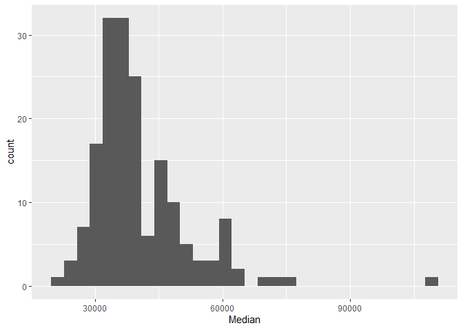
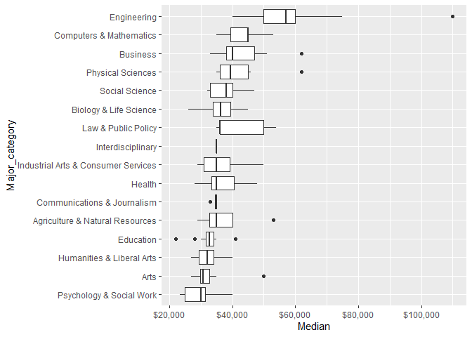
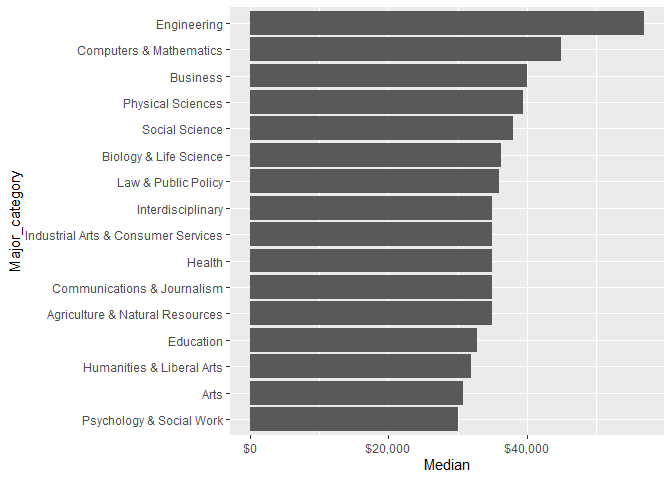
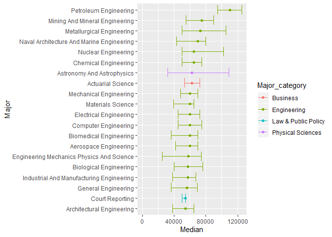
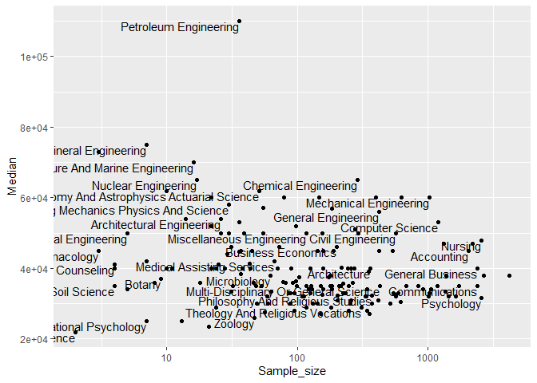
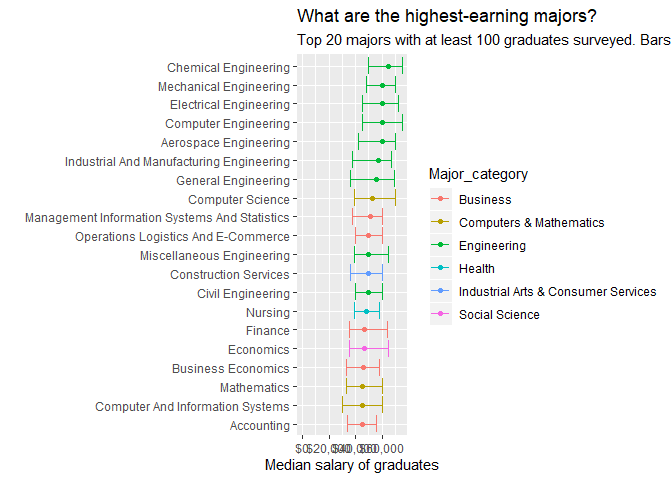
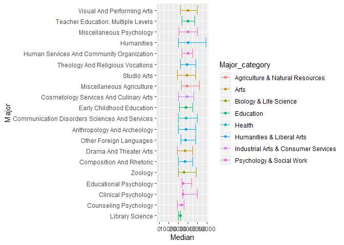

College Majors & Incomes
================
Alexis Colangelo
12/18/2019

``` r
library(tidyverse)
```

    ## -- Attaching packages ---------------------------------------------- tidyverse 1.2.1 --

    ## v ggplot2 3.2.1     v purrr   0.3.2
    ## v tibble  2.1.3     v dplyr   0.8.3
    ## v tidyr   1.0.0     v stringr 1.4.0
    ## v readr   1.3.1     v forcats 0.4.0

    ## -- Conflicts ------------------------------------------------- tidyverse_conflicts() --
    ## x dplyr::filter() masks stats::filter()
    ## x dplyr::lag()    masks stats::lag()

``` r
library(scales)
```

    ## 
    ## Attaching package: 'scales'

    ## The following object is masked from 'package:purrr':
    ## 
    ##     discard

    ## The following object is masked from 'package:readr':
    ## 
    ##     col_factor

Read in
dataset

``` r
recent_grads = read_csv("https://raw.githubusercontent.com/rfordatascience/tidytuesday/master/data/2018/2018-10-16/recent-grads.csv") 
```

    ## Parsed with column specification:
    ## cols(
    ##   .default = col_double(),
    ##   Major = col_character(),
    ##   Major_category = col_character()
    ## )

    ## See spec(...) for full column specifications.

### What categories of majors make more money than others?

Distribution of median income

``` r
recent_grads %>%
  ggplot(aes(Median)) +
  geom_histogram()
```

    ## `stat_bin()` using `bins = 30`. Pick better value with `binwidth`.

<!-- -->

Major category looks like it explains a lot of the variation

``` r
recent_grads %>%
  mutate(Major_category = fct_reorder(Major_category, Median)) %>%
  ggplot(aes(Major_category, Median)) +
  geom_boxplot() +
  scale_y_continuous(labels = dollar_format()) +
  coord_flip()
```

<!-- -->

``` r
recent_grads %>%
    mutate(Major_category = fct_reorder(Major_category, Median)) %>%
  group_by(Major_category) %>%
  summarize(Median = median(Median)) %>%
  ggplot(
    aes(Major_category, Median)) +
  geom_col() +
  scale_y_continuous(labels = dollar_format()) +
  coord_flip()
```

<!-- -->

### What are the highest earning majors?

``` r
majors_processed =
  recent_grads %>%
  arrange(desc(Median)) %>%
  select(Major, Major_category, Median, P25th, P75th) %>%
   mutate(Major = str_to_title(Major),
     Major = fct_reorder(Major, Median))
  
majors_processed %>%
  head(20) %>%
  ggplot(aes(Major, Median, color = Major_category)) +
  geom_point() +
  geom_errorbar(aes(ymin = P25th, ymax = P75th)) +
  expand_limits(y = 0) +
  coord_flip()
```

<!-- -->

``` r
majors_processed =
  recent_grads %>%
  arrange(desc(Median)) %>%
  select(Major, Major_category, Median, P25th, P75th, Sample_size) %>%
   mutate(Major = str_to_title(Major),
     Major = fct_reorder(Major, Median))


majors_processed %>%
  ggplot(aes(Sample_size, Median)) +
  geom_point() +
  geom_text(aes(label = Major), check_overlap = TRUE, vjust = 1, hjust = 1) +
  scale_x_log10()
```

<!-- -->

``` r
majors_processed %>%
  filter(Sample_size >= 100) %>%
  head(20) %>%
  ggplot(aes(Major, Median, color = Major_category)) +
  geom_point() +
  geom_errorbar(aes(ymin = P25th, ymax = P75th)) +
  expand_limits(y = 0) +
  scale_y_continuous(labels = dollar_format()) +
  coord_flip() +
  labs(title = "What are the highest-earning majors?",
       subtitle = "Top 20 majors with at least 100 graduates surveyed. Bars represent the 25th to 75th percentile.",
      x = "",
      y = "Median salary of graduates")
```

<!-- -->

### What are the lowest earning majors?

``` r
majors_processed %>%
  tail(20) %>%
  ggplot(aes(Major, Median, color = Major_category)) +
  geom_point() +
  geom_errorbar(aes(ymin = P25th, ymax = P75th)) +
  expand_limits(y = 0) +
  coord_flip()
```

<!-- -->
